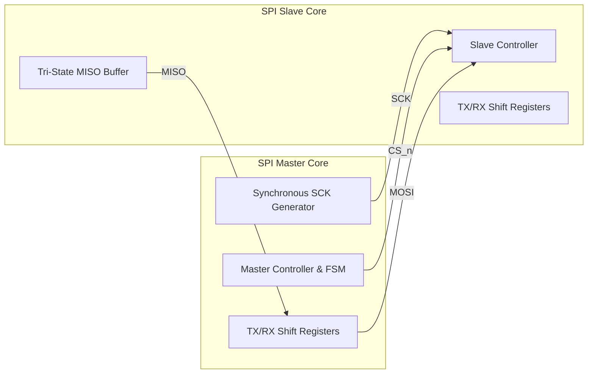
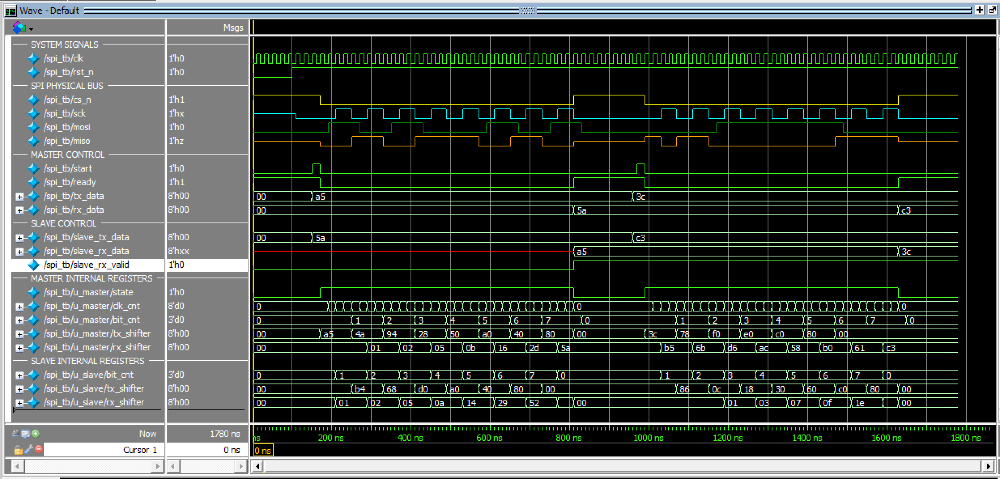

# Synchronous Glitch-Free SPI Master/Slave IP Core (Verilog HDL)


-orange)


A fully synthesis-ready, glitch-free **Serial Peripheral Interface (SPI) Master and Slave IP Core** designed in Verilog HDL. This repository provides a standalone, robust SPI controller operating in **SPI Mode 0 (CPOL = 0, CPHA = 0)** with dynamic clock division and Clock Domain Crossing (CDC) prevention.

---

## Key Architecture & Features

### 1. Synchronous Glitch-Free SCK Generation
* Generates serial clock `SCK` via a synchronous counter driven by system clock `clk`.
* Avoids combinational clock-gating glitches, making the IP core 100% synthesis-friendly for ASIC/FPGA designs.

### 2. CDC Prevention & Single-Cycle Edge Strobes
* Prevents Clock Domain Crossing (CDC) metastability by producing single-cycle pulse strobes (`sck_rise` and `sck_fall`) within the main system clock domain.
* All shift register sampling (`MISO`) and driving (`MOSI`) actions are triggered synchronously by edge strobes.

### 3. Tri-State MISO & Dynamic MSB Preloading
* **Tri-State MISO:** The SPI Slave core automatically drives `MISO` into a high-impedance state (`1'bz`) when Chip Select (`cs_n = 1`) is inactive, enabling multi-slave bus sharing.
* **Preload Logic:** Dynamically preloads the MSB onto `MISO` upon `cs_n` assertion (`0`) to prevent bit alignment loss on the first clock edge.

---

## Block Diagram



---

## Verification & Waveform Results

The testbench (`tb/tb.v`) verifies full-duplex transactions between SPI Master and Slave cores.



### Key Waveform Observations:
* **Transaction 1:** Master transmits `0xA5`, Slave responds with `0x5A`. Master receives `0x5A`, Slave receives `0xA5`.
* **Transaction 2:** Master transmits `0x3C`, Slave responds with `0xC3`. Master receives `0xC3`, Slave receives `0x3C`.
* **Tri-State Behavior:** `miso` enters High-Z (`1'bz`) as soon as `cs_n` returns to `1` (idle state).

---

## How to Run Simulation

### Prerequisites
* EDA Tool: QuestaSim / ModelSim (Intel FPGA Edition or standard).

### Steps:
1. Open **QuestaSim / ModelSim**.
2. Change directory to the `sim/` folder:
   ```tcl
   cd "sim"
   ```
3. Run the TCL simulation script:
   ```tcl
   do run.tcl
   ```

---

## Repository Structure

```text
SPI-Master-Slave-Core/
├── README.md                      # Project documentation
├── .gitignore                     # Git ignore rules for EDA build outputs
├── docs/                          # Waveform screenshots
│   └── spi_master_slave_waveform.png
├── rtl/                           # Verilog HDL RTL source files
│   ├── SPI_Master.v               # SPI Master Core
│   └── SPI_Slave.v                # SPI Slave Core
├── tb/                            # Verification Testbench
│   └── tb.v                       # SPI Master-Slave Testbench
└── sim/                           # Simulation Scripts
    └── run.tcl                    # QuestaSim TCL script
```

---

## Author

* **Role:** RTL Design & Verification Engineer

<h3>Contact Me</h3>
<p>
  <a href="[https://github.com/macquangkhai](https://github.com/macquangkhai)">
    
  </a>
  
  <a href="mailto:khaimac616@gmail.com">
    
  </a>
</p>
